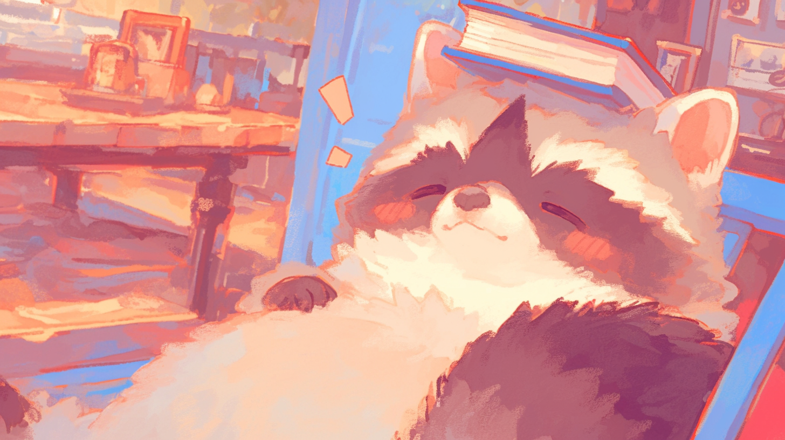

# Home

<h2 align="center">wiki.trashpanda</h2>

We make guides, have fun, and have no idea what we're doing, but we'll keep doing it.

***

## Browse

<table data-view="cards"><thead><tr><th></th><th></th><th></th><th data-type="content-ref"></th><th data-hidden data-card-target data-type="content-ref"></th><th data-hidden data-card-cover data-type="image">Cover image</th></tr></thead><tbody><tr><td><h4><i class="fa-book-blank">:book-blank:</i></h4></td><td><strong>Requires Literacy &#x26; Comprehension Skills</strong></td><td>Read all of our community guides here</td><td></td><td><a href="https://template.gitbook.com/space-product-docs">https://template.gitbook.com/space-product-docs</a></td><td><a href=".gitbook/assets/racoon-5.png">racoon-5.png</a></td></tr><tr><td><h4><i class="fa-locust">:locust:</i></h4></td><td><strong>We are Not Locust, or Maybe We are</strong></td><td>Check out our members' spaces. <em>*crickets*</em></td><td></td><td><a href="https://template.gitbook.com/space-product-docs">https://template.gitbook.com/space-product-docs</a></td><td><a href=".gitbook/assets/racoon-4.png">racoon-4.png</a></td></tr><tr><td><h4><i class="fa-banana">:banana:</i></h4></td><td><strong>The Cleaning Man Wasn’t Thrilled about Us</strong></td><td>Browse the <del>trashcan.</del>  We definitively didn't hide food here</td><td></td><td><a href="https://template.gitbook.com/space-api-reference">https://template.gitbook.com/space-api-reference</a></td><td><a href=".gitbook/assets/racoon-6.png">racoon-6.png</a></td></tr></tbody></table>

***


{% column width="50%" valign="middle" %}
### A local model enthusiast?!  Get started in 5 minutes

Lorem ipsum dolor sit amet, consectetur adipiscing elit, sed do eiusmod tempor incididunt ut labore et dolore magna aliqua. Why are you reading this. Ut enim ad minim veniam, quis nostrud exercitation ullamco laboris nisi ut aliquip ex ea commodo consequat. Go use Snowdrop v0. Duis aute irure dolor in reprehenderit in voluptate velit esse cillum dolore eu fugiat nulla pariatur.

<a href="https://huggingface.co/trashpanda-org" class="button primary" data-icon="face-smiling-hands">Get started</a> <a href="https://www.kaggle.com/code/divinesinner/koboldcpp-guide-in-comment" class="button secondary" data-icon="kaggle">Run it on Kaggle</a>


{% column width="50%" valign="middle" %}
<figure><figcaption></figcaption></figure>



***



<figure><figcaption></figcaption></figure>



### Read this

Read guides, watch tutorials, and learn more about ~~computer.~~ We shill our members here.

<a href="https://template.gitbook.com/space-help-center" class="button primary" data-icon="book-open">Guides</a> <a href="https://template.gitbook.com/space-product-docs" class="button secondary" data-icon="book">Documentation</a>



***

<h2 align="center">1000% Non-nerds and Friendly! </h2>

We don't have feet pictures though, but we have something called DLLM.

Don't know what that is?! You're missing out.

<a href="./#wiki.trashpanda" class="button primary" data-icon="discord">Spimy</a>

