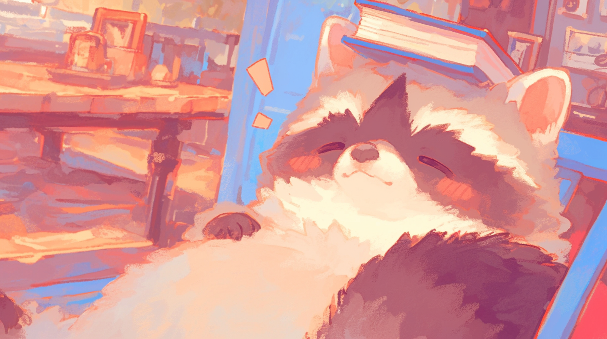

# Home

<h2 align="center">wiki.trashpanda</h2>

We make guides, have fun, and have no idea what we're doing, but we'll keep doing it.

***

## Browse

<table data-view="cards"><thead><tr><th></th><th></th><th></th><th data-hidden data-card-target data-type="content-ref"></th><th data-hidden data-card-cover data-type="image">Cover image</th></tr></thead><tbody><tr><td><h4><i class="fa-book-blank">:book-blank:</i></h4></td><td><strong>Requires Literacy &#x26; Comprehension Skills</strong></td><td>Read all of our community guides here</td><td><a href="https://app.gitbook.com/o/Nhr4jPKDl6T7COhEkFfR/s/909EFXMZKIgW9h8StODF/">Community Guides</a></td><td><a href=".gitbook/assets/read.jpg">read.jpg</a></td></tr><tr><td><h4><i class="fa-locust">:locust:</i></h4></td><td><strong>We are Not Locust, or Maybe We are</strong></td><td>Check out our members' spaces. <em>*crickets*</em></td><td><a href="https://app.gitbook.com/o/Nhr4jPKDl6T7COhEkFfR/s/2GLul6jrsVTnj3ByxLyC/">What is Playground</a></td><td><a href=".gitbook/assets/friends.png">friends.png</a></td></tr><tr><td><h4><i class="fa-banana">:banana:</i></h4></td><td><strong>The Cleaning Man Wasn’t Thrilled about Us</strong></td><td>Browse the <del>trashcan.</del>  We definitively didn't hide food here</td><td><a href="./#a-local-model-enthusiast-get-started-in-5-minutes">#a-local-model-enthusiast-get-started-in-5-minutes</a></td><td><a href=".gitbook/assets/caught.png">caught.png</a></td></tr></tbody></table>

***


{% column width="50%" valign="middle" %}
### A local model enthusiast?!  Get started in 5 minutes

Want to run models locally? Try out our models.

<a href="https://huggingface.co/trashpanda-org" class="button primary" data-icon="face-smiling-hands">Get started</a> <a href="https://www.kaggle.com/code/divinesinner/koboldcpp-guide-in-comment" class="button secondary" data-icon="kaggle">Run it on Kaggle</a>


{% column width="50%" valign="middle" %}
<figure><figcaption></figcaption></figure>



***



<figure><figcaption></figcaption></figure>



### Read this

Read guides, watch tutorials, and learn more about ~~computer.~~ We shill our members here.

<a href="https://app.gitbook.com/o/Nhr4jPKDl6T7COhEkFfR/s/909EFXMZKIgW9h8StODF/" class="button primary" data-icon="book-open">Guides</a> <a href="./" class="button secondary" data-icon="book">Documentation</a>



***

<h2 align="center">1000% Non-nerds and Friendly! </h2>

We don't have feet pictures though, but we have something called DLLM.

Don't know what that is?! You're missing out.

